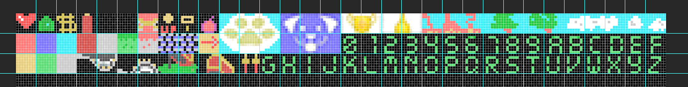
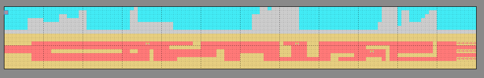
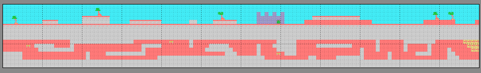

# LEO must live

LEO debe vivir es una idea de Pedro Otalora para el grupo (MSX spain)[http://msx.tipolisto.es/quien-somos] esperamos que sea un juego para el (MSXBlog Konamito contest)[https://www.msxblog.es/].

LEO must live we hope it will be a game for the LEO must live is an idea by Pedro Otalora for the group (MSX spain)[http://msx.tipolisto.es/quien-somos] we hope it will be a game for him (MSXBlog Konamito contest)[https://www.msxblog.es/]

## Play online

https://msx-spain.github.io/LEO-must-live/?disk=game.dsk

# Instructions

Conduce a Leo no te salgas de salgas del camino, ¡cuidado! Leo va muy rápido y puedes confundirte de camino, recoge todas las monedas que encuentres para sumar puntos e intenta llegar hasta el final.

Drive Leo don't go off the road, be careful! Leo goes very fast and you can get confused on the way, collect all the coins you find to score points and try to reach the end.

# Development

## Spriteset

## Tileset

# Screens /levels

Level 1

Level 2

Level 3

## Build

Escriba en en el terminal o ventana de comandos o terminal de unix:

Type in in the terminal or command window or unix terminal:

*make*: para correr su emulador favorito utilizando la función DirAsDisk.

*make all*: para correr su emulador y generar los archivos .dsk, .rom, .cas y .tsx

*make dsk*: para correr su emulador, utilizando un archivo dsk generado

*make rom*: para correr su emulador, utilizando un archivo rom generado

*make cas*: para correr su emulador, utilizando un archivo cas generado

*make tsx*: para correr su emulador, utilizando un archivo tsx generado

otra opción es crear una tarea en vscode y ejecutarla

*make clean*

*make clean all*: borrar los archivos temporales y los archivos obj, dsk, rom, cas y tsx

# Structure / scafolding

src: están los archivos fuente bas y asm

assets: irán los archivos creados con programas que no tienen que ser copiados pero si pueden ser automatizados

    *.xspr son archivos creados con spritedevtools que serán convertidos a .bas o .bin

    *.tmx y *.csv archivos creados con tilemap que serán convertidos a .bin

    *.psd, creados con photoshop

    *.jpg y *.png capturas, fotos descargadas o retocadas

    *.sc2  Screens generados por MSX1-graphic-converter,*.sc5,etc generados con msxviewer, nMSXTIles/MSXTilesdevtool, 

    *.pt3,*.wiz,*.mwm, *.mbm audios creados con vortes tracker, arckos tracker, wiz tracker, moundblaster, etc 

    * compiladores xbasic.bin, nbasic.bin turbobasic, nextorbasic

dsk: carpeta que es utilizada para trabajar como DiskAsDir

tools: van todos los programas que necesitemos

docs: irán los archivos de la documentación, también el index.html con el webMSX y el dsk de prueba

